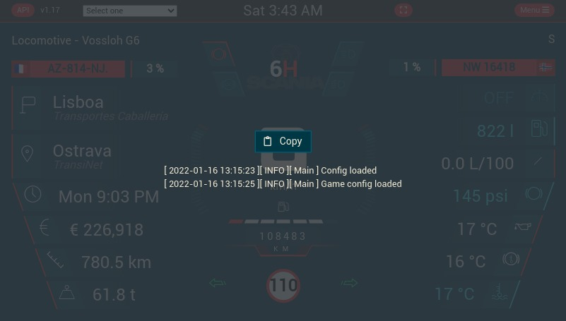

# Contributing

Hi there, if you're here, I'll say to you: THANKS !

Currently, you can only contribute for the map tiles, but in a future, I'll write somes lines to guide you for the code
contribution.

You can join the discord to exchange about it
;) [](https://discord.gg/8abqrEeFxF)

## How to

If you want to contribute in this project, you can:

- Stars this project
- Share this project
- [Suggest a feature](https://github.com/JAGFx/ets2-dashboard-skin/issues/new?assignees=&labels=&template=feature_request.md&title=)
- [Create an issue](https://github.com/JAGFx/ets2-dashboard-skin/issues/new?assignees=&labels=bug%2C+feature%2Ftodo&template=bug_report.md&title=)
- Suggest your code contribution (for a feature, a bugfix or other)

For the last point, please read in full this contribution guide.

## Identify a problem

If you encounter a problem with this application, please check all suggestions:

- [x] The application launches without errors.
- [x] The device is connected on the same network as the application.
- [x] The game is launched and you are on the road (If you don't make the spawn once on the road, the connection will
  not be made).
- [x] Check if a known problem [has been listed](doc/KNOW_ISSUES.md)
- [x] Run the application as an administrator

If you still have a problem, you
can [open a bug on Github](https://github.com/JAGFx/ets2-dashboard-skin/issues/new?assignees=&labels=bug%2C+feature%2Ftodo&template=bug_report.md&title=)

> Note: If the application crashes and closes immediately, you can open a terminal and type `ets2-dashboard-skin.exe`. With this, the application will not crash anymore and the error will be displayed.

Please give all mentioned information about the problem. Without this, I am not able to reproduce the problem and solve
it.

- [x] Give the device used (PC, Tablette or Mobile)
- [x] Give the device details (OS, browser used)
- [x] Give the application version used
- [x] Give the SCS telemetry version used
- [x] Give the skin name if necessary
- [x] Give the log file

### Logs

Logs data will be available in the place:

- In-app logs
- File on `logs/` folder 

To activate In-app log, tap five (5) time in the top-left corner to display the log view. You'll be able to copy and past them.



## Contributing

Many thanks if you want to contribute on this project.

Please follow the "fork-and-pull" Git workflow.

1. **Fork** the repo on GitHub
2. **Clone** the project to your own machine
3. **Commit** changes to your own branch
4. **Push** your work back up to your fork
5. Submit a [**Pull request**](https://github.com/JAGFx/ets2-dashboard-skin/compare) so that we can review your changes

All point on the pull request description must be checked and completed (if applicable).

## Prepare your local instance

### Requirements

This project use NodeJs. Please be sure the NodeJs v14+ is installed before.

This project can be developed on **Linux** or **Windows**

### Installation

1. Clone this repository
2. 1Install dependencies

#### Clone this repository

````bash
$ git clone https://github.com/JAGFx/ets2-dashboard-skin.git
$ cd ets2-dashboard-skin
````

#### Install dependencies

````bash
$ npm i && npm rb
````

#### Environment file

This project use a `.env` file. If you wan to override one or more variable in the development, create a `.env.local` at
the same place of the `.env` file

#### Telemetry data

If you want to use a fake file data instead of the data from the SCS API, set the `VUE_APP_USE_FAKE_DATA` to `true`

```dotenv
VUE_APP_USE_FAKE_DATA=true
```

#### Useful commands

|Description|Command|
|---|---|
|Launch the dashboard development app|`$ npm run dashboard:dev`|
|Build the dashboard dist files for the production|`$ npm run dashboard:build`|
|Start the production version of dashboard|`$ npm run dashboard:start`|
|Start a tiny version of server to get data through Socket|`$ npm run server:dev`|
|Create a font with all svg files from the resources directory<br><br>To get more details, see [RESOURCES.md](doc/RESOURCES.md)|`$ npm run font:build`|
|Launch the linter|`$ npm run lint`|

## Others stuff

### Resources

I provide all resources what I'm use to develop this dashboard. Such as svg, AI file for svg or others element who can
be need to contribute too.

See the [RESOURCES.md](doc/RESOURCES.md) section to get more details

### Map

The map tiles was generated from a side project: [JAGFx/ts-map](https://github.com/JAGFx/ts-map)

When can you request a map tiles update ? At each new minor release, you can request an update.

If a new map DLC are released through the same minor version of the current game, you don't need to follow this guide.
You just need to generate the map tiles collection and share it to me. See
this [readme](https://github.com/JAGFx/ts-map/tree/feat/rework#how-to-use-) ;)

Example of valid version for the requesting:

- `1.39.1.1`
- `1.40.1.1`
- `1.41.1.1`

Example of **INVALID** version for the requesting:

- `1.41.1.1`
- `1.41.2.1`
- `1.41.2.2`

#### Tiles generation

- 1/ [Download](https://github.com/JAGFx/ts-map/releases/download/v1.0.0-cli-beta/TsMap2.rar)
  the [JAGFx/ts-map](https://github.com/JAGFx/ts-map) program
- 2/ Generate a setting file: `TsMap2.exe export -s` and follow instruction
- 3/ Generate tiles `TsMap2.exe export`
- 4/ Create an archive with all content from the `Output` folder

#### Update version

To keep a backward compatibility, we need to add the old map tiles entry on the map configuration.

For example, if you're on **Euro truck simulator 2** or **American truck simulator** `1.40.x.x` and a new
version `1.41.x.x` was just release, you must set an old value for the `1.40.x.x`

Please note:

- Only map tile update for minor release will be accepted (`1.40.x.x`, `1.41.x.x`, etc...)
- The map tiles will be updated when both game will on this new version

#### Edit the map configuration file

This file are located at `src/data/config/map.json`. On it, identify the entry `maps_map_tilesVersion` and add another
entry at the end of `values`:

````json
{
	"label" : "v1.40",
	"value" : "1.40"
}
````

Example of the `maps_map_tilesVersion` entry after editing:

````json
{
	"id" :          "maps_map_tilesVersion",
	"label" :       "Game version",
	"description" : "The latest get the tiles for the latest version, else the specified version",
	"values" :      [
		{
			"label" : "Latest",
			"value" : "latest"
		},
		{
			"label" : "1.40",
			"value" : "1.40"
		}
	]
}
````
### Translations  

You can help translating the application by following these steps.


- 1 Create a file at `src/translations` and name it to the disired [BCP 47 Code](https://www.techonthenet.com/js/language_tags.php), appended with the `.yaml` extension.  
Example for `de-DE` (German Germany): `de-DE.yaml`  

- 2 Open the new file with a text editor and copy the contents of another translation file into your new file, using [fr-FR.yaml](https://github.com/JAGFx/ets2-dashboard-skin/blob/master/src/translations/fr-FR.yaml) located at `src/translations/fr-FR.yaml` for example.  

- 3 Translate all keys, by changing the values to the desired language.  

Example:  
`Key : Value`    
````
Delivered !: Geliefert !   
Config : Konfigurationen 
````
- 3.1 Add a new line at the end of the file with the language translated.
Example:
`German : Deutsch`  

> Note: *Do not leave trailing spaces` `  and try to respect punctuation marks*.  

- 4 Save your file and place the file inside the `src/translations/` folder.

- 5 Open your local copy of [doc\TRANSLATION_CHANGESmd](TRANSLATION_CHANGES.md).
At the top, after `# Translation changes`, you will find the version number, like `## From 1.7.1`.  
Add a new line below `### Added` containing the name of the new language.
Example: 
````
### Added

- German
````

- 6 Edit the file [src/data/config-field-values.json](https://github.com/JAGFx/ets2-dashboard-skin/blob/master/src/data/config-field-values.json) and scroll down or find the section `"general_skin_locale"`.  

Append the `label` and `value` sub-section, given that **label** is the language name and **value** is the BCP 47 Code.  
It should look like this, at the end of the section:  

````json
"general_skin_locale" :          [
		
		{
			"label" : "Russian",
			"value" : "ru-RU"
		},
		{
			"label" : "German",
			"value" : "de-DE"
		}
	]
````  

- 7 Edit the file [src/utils/_i18n.js](https://github.com/JAGFx/ets2-dashboard-skin/blob/master/src/utils/_i18n.js)  

- 7.1 Insert in a new line
````js
import de_de from '@/translations/de-DE.yaml';
````  
after the lines  
````js
import fr_fr from '@/translations/fr-FR.yaml';
import cn_cn from '@/translations/cn-CN.yaml';
import ru_ru from '@/translations/ru-RU.yaml';
```` 

- 7.2 Edit the values at `const availableLocale =` and add the new values to the array.
As such:
````js
const availableLocale = ['fr-FR', 'en-EN', 'cn-CN', 'ru-RU', 'pt-PT', 'de-DE'];
````  

- 7.3 Insert a new case at `const currentLocaleTranslations =` before the `default:` line.
````js
case 'pt-PT':
    return pt_pt;
case 'de-DE':
	return de_de;
 default:
      return {};
````  

- 8 Save every change and test the translation by launching the dashboard development server with  
`$ npm run dashboard:dev`, as described above in [Useful commands](#useful-commands)  
- Open your browser and navigate to one of the url's provided by the server.
````
  - Local:   http://localhost:8080/
  - Network: http://192.168.1.65:8080/
````  

- 9 Create a pull request by following this link: [JAGFx ETS2 Pulls](https://github.com/JAGFx/ets2-dashboard-skin/pulls) and click on **New Pull Request**

- If you are having issues or don't know how to edit any file, you can ask for help or just edit the sample [fr-FR.yaml](src/translations/fr-FR.yaml) file and send your translation via [Discord](https://discord.gg/qYsFaMUR67). Some members may be able to help filling in the rest of the requirements.

- More information about how to do a pull request can be found here [Github - Creating a Pull Request](https://docs.github.com/en/pull-requests/collaborating-with-pull-requests/proposing-changes-to-your-work-with-pull-requests/creating-a-pull-request)


### Next release

