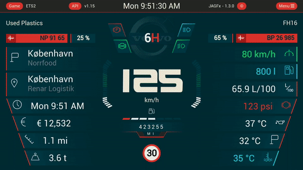

# Eurotruck Simulator 2 Dashboard skin

## About

The idea with this repository is to update a collection of dashboard from
the [Funbit repository](https://github.com/Funbit/ets2-telemetry-server) with the newest SCS SDK.

And then, use a best way to maintain the different dashboard.

The first to be rework are my own dashboard. In the future, all dashboard in the *Funbit repository* will be include

This project was based on the [TruckSim-Telemetry-Demo](https://github.com/kniffen/TruckSim-Telemetry-Demo)

You can check also a review and installation guide made
by [Neranjana Wijesinghe](https://www.youtube.com/playlist?list=PLJONr1a8YX5Tyw-i49yk2jYTAFJJ5h7fw)

## What's it ?

This is an web app who you can choose over dashboard skin (Custom or from other truck brand (DAF, Man, Mercedes,
Renault, Scania or Volvo))
. [See screenshots here](https://github.com/JAGFx/ets2-dashboard-skin/blob/master/doc/SKINS.md)

I'm also introduce the possibility to change the unit of measurement as you
prefer. [See the full list here](https://github.com/JAGFx/ets2-dashboard-skin/blob/master/doc/CONFIG_SETTINGS.md)

A event overlay can also be configured !

Now, you've got a map integration !

It's work on desktop and mobile browser.

## Map

### Support

If you're interested, check the [`JAGFx/ts-map`](https://github.com/JAGFx/ts-map) project.

More information on the [Map](./doc/MAP.md) readme

> Many thanks to [TwinDragon](https://github.com/TwinDragon) for maintaining a map tiles collection up to date for each new game version

### Offline

See the [SCS_Map_Tiles](https://github.com/TwinDragon/SCS_Map_Tiles#supported-maps) repository for supported game, versions available and download links

## Internationalization

Set your locale on the configuration tab

Available locales: 

- Chinese (cn_CN) - Thanks to [dreamstar-2020](https://github.com/dreamstar-2020)
- English (en_EN)
- French (fr_FR)
- Russian (ru_RU) - Thanks to [Jonny_Bro](https://github.com/JonnyBro)

## Requirements

- OS: Windows 64Bits
- Game: Euro Truck Simulator 2
- SCS SDK plugin: v1.11
- Web-browser: Chrome (Desktop and Mobile), Firefox (Desktop dans Mobile), Edge ( Desktop and mobile )

**Important: It dosen't work with all Internet Explorer browsers**

## How to use ?

### Prerequisite

Install *[scs-sdk-plugin](https://github.com/RenCloud/scs-sdk-plugin)* by RenCloud

- Download the supported version zip `v1.11` at
  the [release](https://github.com/RenCloud/scs-sdk-plugin/releases/download/V.1.11/release_v_1_11.zip) page
- Extract the DLL file into your game folder like `C:\you-game-path\bin\win_x64\plugins\`

### Installation

You can use this dashboard without build anything.

You can download the `*.tar.gz` archive from the [release](https://github.com/JAGFx/ets2-dashboard-skin/releases/latest)
page.

Extract this archive and run the `ets2-dashboard-skin_vX.X.X.exe`. That's it ! 

> Note: You need to start the game to see the dashboard

### Use from desktop device

1. Open your favorite web browser
2. Go to [http://localhost:3000](http://localhost:3000)

And that's it :D

### Use from a mobile device

1. Find your local IP address for your PC (Find
   how [here](https://www.whatismybrowser.com/detect/what-is-my-local-ip-address))
2. Open a web browser on your mobile device
3. Access to the dashboard on your mobile: `http://<YOUR_LOCAL_IP>:3000` (e.g. `http://192.168.1.42:3000`)
4. And voilà ! You can enable / disable the fullscreen on tap on the dashboard

> Note: Your mobile device AND your PC need to be on the same network

> Tip: You can save a shortcut on your home screen to use it as an app like.

If you want to use another port, change it on the configuration file.

## Breaking change

See the [BREAKING_CHANGES.md](doc/BREAKING_CHANGES.md) readme

## Translation change

See the [TRANSLATION_CHANGES.md](doc/TRANSLATION_CHANGES.md) readme

## Know issues

If you found an issue, please see the [KNOW_ISSUES.md](doc/KNOW_ISSUES.md). Your issue may be already known.

## Features

To see all features used into the dashboard, see the [FEATURES.md](doc/FEATURES.md).

## Skins

To know more about the skin integrated or how to add a new skin, see the [SKINS.md](doc/SKINS.md)

## Configuration

To know more about the configuration, see the [CONFIG_SETTINGS.md](doc/CONFIG_SETTINGS.md)

## Contributing

If you want to contribute, see the [CONTRIBUTING.md](CONTRIBUTING.md)

## License
Under the [MIT License](LICENSE)

© JAGFx - hey@emmanuel-smith.me
