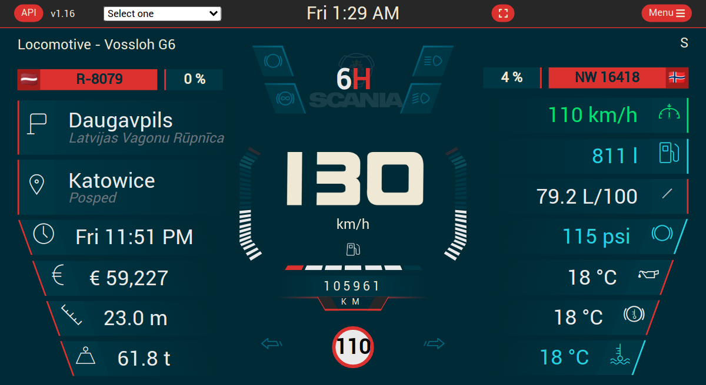

# Eurotruck Simulator 2 Dashboard skin

## About

The idea with this repository is to update a collection of dashboard from the [Funbit repository](https://github.com/Funbit/ets2-telemetry-server) with the newest SCS SDK.

And then, use a best way to maintain the different dashboard.

The first to be rework are my own dashboard. In the future, all dashboard in the *Funbit repository* will be include

This project was based on the [TruckSim-Telemetry-Demo](https://github.com/kniffen/TruckSim-Telemetry-Demo)



## Prerequisite

### scs-sdk-plugin

Install *[scs-sdk-plugin](https://github.com/RenCloud/scs-sdk-plugin)* by RenCloud

- Download the latest release zip name like `release_v_1_10_5.zip` at the [release page](https://github.com/RenCloud/scs-sdk-plugin/releases/latest)
- Extract the DLL file into your game folder like `C:\you-game-path\bin\win_x64\plugins\`

### Windows-Build-Tools

Install *[Windows-Build-Tools](https://github.com/felixrieseberg/windows-build-tools)*

````bash
$ npm install --global windows-build-tools
````

## Installation

### Clone this repository

````bash
$ git clone https://github.com/JAGFx/ets2-dashboard-skin.git
$ cd ets2-dashboard-skin
````

### Build resources

````bash
$ npm run dashboard:build
$ npm run server:build
````

## Development

### Telemetry data
If you want to not use the ETS2 telemetry data, you can set it `.env.local` file.

Set the `VUE_APP_USE_FAKE_DATA` to `true`

```bash
$ nano .env.local
> VUE_APP_USE_FAKE_DATA=true
```

### Config data
See [CONFIG_SETTINGS.md](CONFIG_SETTINGS.md)

### Start development server
````bash
$ npm run dashboard:dev
````

## License
Under the [MIT License](LICENSE)

© JAGFx - hey@emmanuel-smith.me
