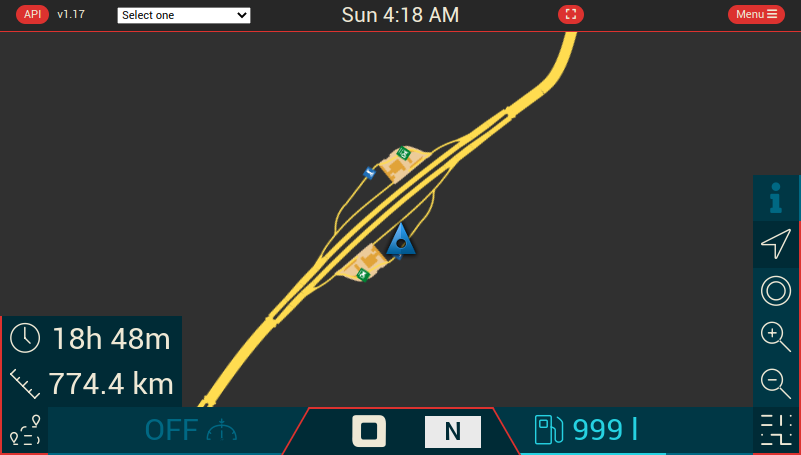

# Features

## General

I'm introduce an overlay for processing (e.g. saving config, loading config and upload config) and error.

In the error overlay, you can access to the full errors details.

Why the full details ? It can help me to debug and fix the error. Please to email me or create an issue with this detail ;)

See the [Issue template](https://github.com/JAGFx/ets2-dashboard-skin/issues/new?assignees=&labels=bug%2C+feature%2Ftodo&template=bug_report.md&title=) 

## Skin

In this app, you find all skin from the [Funbit / ets2-telemetry-server](https://github.com/Funbit/ets2-telemetry-server)

The goal of this project is to have the skin dashboard for this repository with the latest telemetry data.

- JAGFx
- Map
- Base
- Default
- DAF XF
- Man TGX
- Mercedes Benz Atego
- RenaultDash-Info
- Scania Dashboard
- Volvo FH 2012 Dashboard

On the **JAGFx** skin, you can display the map on the right side.

To enable it, go to `Menu > Config > JAGFx > Display map` and set it to `On`

## Events overlay

When an event occurred from the game, an overlay was displayed with some data (if available)).

Which events ? See the list below:

- Game pause
- Road fine
- Toll gate
- Ferry travel
- Train travel
- Refuel payed
- Job canceled
- Job delivered
- Job finished
- Job started
- Speed limit
- Trailer coupled
- Trailer damage
- Cruise control set
- Cruise control increase
- Cruise control decrease
- Truck warning
- Truck emergency
- Truck electric
- Truck engine
- Truck park
- Truck damage
- Truck refuel

## Configuration

For all skin, you can set more information (unit or other setting).
Go to `Menu > Config` to change with your preference.

### How to

The configuration files are stored in the version archive.

The configuration files are divided into two files:

- The minimal configuration of the application `config.json`
- The configuration of the game `config.ets2.json` or `config.ats.json`

The old config file `config.ets2-dashboard-skin.json` is deprecated and is not used anymore.

This JSON file store your preference. I'm recommend you to change data from the app instead from file

#### Save my config

To save your config, two-way:
- Click on "Download" button to save config on your device
- Copy & past the config file from the release folder 

Note: All configuration displayed on tab are for the current game.

#### Update my config after release update

When you want to keep your config on a new release, you can:
- Save your config from the old release
- Download and extract the new release
- Upload your config file on the `Menu > Config`

Note: If a missing entry was found, you can't upload your config.

## Log zone

To help me to debug when you have an issue, you can access to a log page.

It keep the last 20 lines.

To open it, tape 5 time in the top left corner.

Click on the copy button to coping this list in your clipboard.

## Maps

I'm proud to introduce the Map (You can retrieve this map on the Ets2-Route-Advisor) !

Currently, I'm introduced the map with some navigation data only. Not the full route advisor.

> Many thanks to [TwinDragon](https://github.com/TwinDragon) for maintaining a map tiles collection up to date for each new game version

#### Features

- ETA remaining time for the current target navigation
- ETA due time for the current target navigation
- ETA remaining distance
- Map controls (North lock, recenter, zoom in and zoom out)
- Current speed
- Current gear
- Fuel level
- Cruise control speed

#### Map support

See the [Map](./MAP.md) section

#### Available configuration

You can choose to show or hide all features elements listed below.

Go to the `Map > Config > Map` section to set your choices ;)

To know all available configurations, see the `CONFIG_SETTINGS.md`

#### Additional setup

See the [Map](./MAP.md) section

## Internationalization

Since `v1.6.6`, you can set your locale. All texts will be displayed on the locale set.

See the configuration  `Menu > General > Langue` and set your locale.

Currently, these locales are available:

- English (en_EN)
- French (fr_FR)

### Add a new language

The translations files are stored inside the `src/translations/` folder.

All translations files are in YAML format. The key is the English version and the value is your locale.  
The format for the file contents is: `key : value`, being `key` in English and `value` the translated equivalent.
If you want to contribute and add a new language: 

- Check changes in [TRANSLATION_CHANGES.md](TRANSLATION_CHANGES.md)
- Get the base file `src/translations/fr-FR.yaml`  
- Follow the instruction provided in [CONTRIBUTING.md](../CONTRIBUTING.md#translations)

---
↩️ [Home](../README.md)
