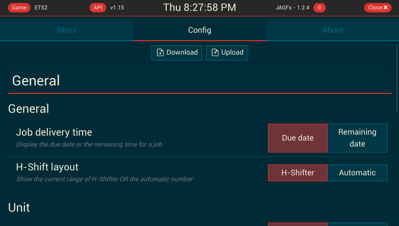
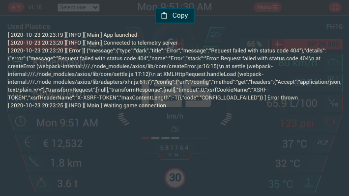

# Features

## General

I'm introduce an overlay for processing (e.g. saving config, loading config and upload config) and error.

In the error overlay, you can access to the full errors details.

Why the full details ? It can help me to debug and fix the error. Please to send me an email or create an issue with this detail ;)

See the [Issue template](https://github.com/JAGFx/ets2-dashboard-skin/issues/new?assignees=&labels=bug%2C+feature%2Ftodo&template=bug_report.md&title=) 

## Skin

In this app, you find all skin from the [Funbit / ets2-telemetry-server](https://github.com/Funbit/ets2-telemetry-server)

The goal of this project is to have the skin dashboard for this repository with the latest telemetry data.

- DAF XF
- Man TGX
- Mercedes Atego
- RD Info
- Scania
- Volvo FH

## Events overlay

When an event occurred from the game, an overlay was displayed with some datas (if available)).

Which events ? See the list below:

- Game pause
- Road fine
- Toll gate
- Ferry travel
- Train travel
- Refuel payed
- Job canceled
- Job delivered
- Job finished
- Job started
- Speed limit
- Trailer coupled
- Trailer damage
- Cruise control set
- Cruise control increase
- Cruise control decrease
- Truck warning
- Truck emergency
- Truck electric
- Truck engine
- Truck park
- Truck damage
- Truck refuel

## Configuration

For all skin, you can set more information (unit or other setting).
Go to `Menu > Config` to change with your preference.

### How to

The config file will stored on the release archive.
It's name `config.ets2-dashboard-skin.json`.

This JSON file store your preference. I'm recommend you to change data from the app instead of this file

#### Save my config

To save your config, two way:
- Click on "Download" button to save config on your device
- Copy & past the config file from the release folder 

#### Update my config after release update

When you want to keep your config on a new release, you can:
- Save your config from the old release
- Download and extract the new release
- Upload your config file on the `Menu > Config`

Note: If a missing entry was found, you can't upload your config.

## Log zone

To help me to debug when you have an issue, you can access to a log page.

It keep the last 20 lines.

To open it, tape 5 time on the left bottom corner.

Click on the copy button to coping this list in your clipboard.

## Maps

I'm proud to introduce the Map (You can retreive this map on the Ets2-Route-Advisor) !

Currently, I'm introduced the map with some navigation data only. Not the full route advisor.

#### Features

- ETA remaining time for the current target navigation
- ETA due time for the current target navigation
- ETA remaining distance
- Map controls (North lock, recenter, zoom in and zoom out)
- Current speed
- Current gear

#### Map support

See the [Map](./MAP.md) section

#### Available configuration

You can chose to show or hide all features elements listed below.

Go to the `Map > Config > Map of route advisor` section to set your choices ;)

To know all available configurations, see the `CONFIG_SETTINGS.md`

#### Additionnal setup

See the [Map](./MAP.md) section

---
↩️ [Home](../README.md)
