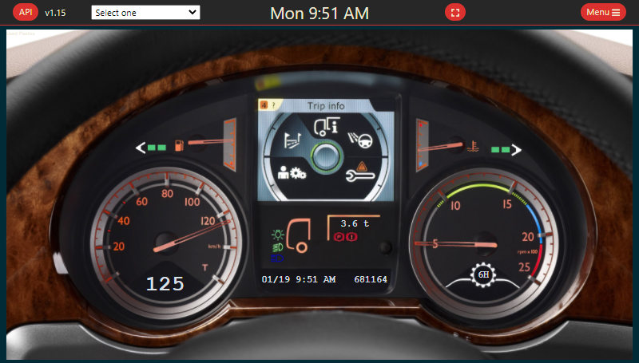

# Skins

You can find the list of all skins integrated.

<table>
    <tr>
        <th>Screenshot</th>
        <th>Name</th>
        <th>Author</th>
    </tr>
    <tr>
        <td></td>
        <td>JAGFx</td>
        <td>Emmanuel SMITH - hey@emmanuel-smith.me</td>
    </tr>
    <tr>
        <td></td>
        <td>Base</td>
        <td>Emmanuel SMITH - hey@emmanuel-smith.me</td>
    </tr>
    <tr>
        <td></td>
        <td>Default</td>
        <td>Funbit</td>
    </tr>
    <tr>
        <td></td>
        <td>DAF-XF</td>
        <td>Klauzzy</td>
    </tr>
    <tr>
        <td></td>
        <td>Man-TGX</td>
        <td>Klauzzy</td>
    </tr>
    <tr>
        <td></td>
        <td>Mercedes Benz Atego</td>
        <td>Klauzzy</td>
    </tr>
    <tr>
        <td></td>
        <td>RenaultDash-Info</td>
        <td>Argiano - van_argiano@outlook.com</td>
    </tr>
    <tr>
        <td></td>
        <td>Scania Dashboard</td>
        <td>Klauzzy</td>
    </tr>
    <tr>
        <td></td>
        <td>Volvo FH 2012 Dashboard</td>
        <td>Klauzzy</td>
    </tr>
</table>

## Create your own

Coming soon
